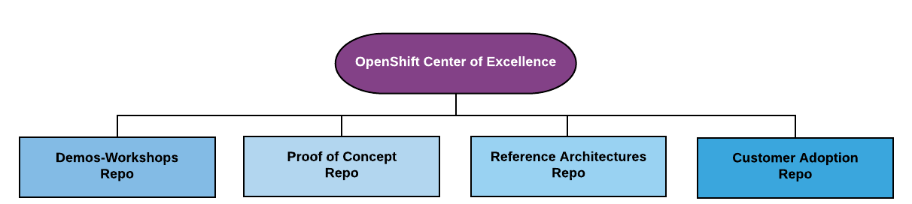

---
# Feel free to add content and custom Front Matter to this file.
# To modify the layout, see https://jekyllrb.com/docs/themes/#overriding-theme-defaults

layout: default
---

OpenShift COE Overview
====================================
This Git Organization is intended to assist OpenShift SME's with a number of core areas related to solution architectures.

The diagram below depicts the core areas covered by associated repos.  

<map name="planetmap">
  <area shape="rect" coords="16,120,190,176" href="https://github.com/ocp-coe/demos-workshops" alt="Sun">
  <area shape="rect" coords="214,120,384,176" href="https://github.com/ocp-coe/pocs" alt="Mercury">
  <area shape="rect" coords="412,120,584,176" href="https://github.com/ocp-coe/reference-architectures" alt="Reference Architecture">
  <area shape="rect" coords="611,120,783,176" href="https://github.com/ocp-coe/customer-adoption" alt="Customer Adoption">
</map>

--------

1. Demos-Workshops - [Demos-Workshops](https://github.com/ocp-coe/demos-workshops/)

2. POC's - [POC's](https://github.com/ocp-coe/pocs/)

3. Reference Architectures - [Reference Architectures](https://github.com/ocp-coe/reference-architectures/)

4. Customer Adoption - [Customer Adoption](https://github.com/ocp-coe/customer-adoption/)
