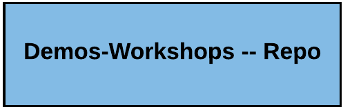

---
# Feel free to add content and custom Front Matter to this file.
# To modify the layout, see https://jekyllrb.com/docs/themes/#overriding-theme-defaults

layout: default
---

OpenShift COE Overview
====================================
This Git Organization is intended to assist OpenShift SME's with a number of core areas related to solution architectures.

  1. The diagram below depicts the core areas covered by associated repos.
    
  ## Demos-Workshops - [Demos-Workshops](https://github.com/ocp-coe/demos-workshops/)  
Test
  <h4><a href="https://github.com/ocp-coe/demos-workshops" target="_blank">Demo Workshops Repo</a> <a href="https://github.com/ocp-coe/pocs" target="_blank">POC-Repo</a><a href="https://github.com/ocp-coe/reference-architectures" target="_blank">Reference Architecture Repo</a><a href="https://github.com/ocp-coe/customer-adoption" target="_blank">Customer Adoption Repo</a></h4>  

   
     

   
Repos
--------

1. Demos-Workshops - [Demos-Workshops](https://github.com/ocp-coe/demos-workshops/)

2. POC's - [POC's](https://github.com/ocp-coe/pocs/)

3. Reference Architectures - [Reference Architectures](https://github.com/ocp-coe/reference-architectures/)

4. Customer Adoption - [Customer Adoption](https://github.com/ocp-coe/customer-adoption/)
